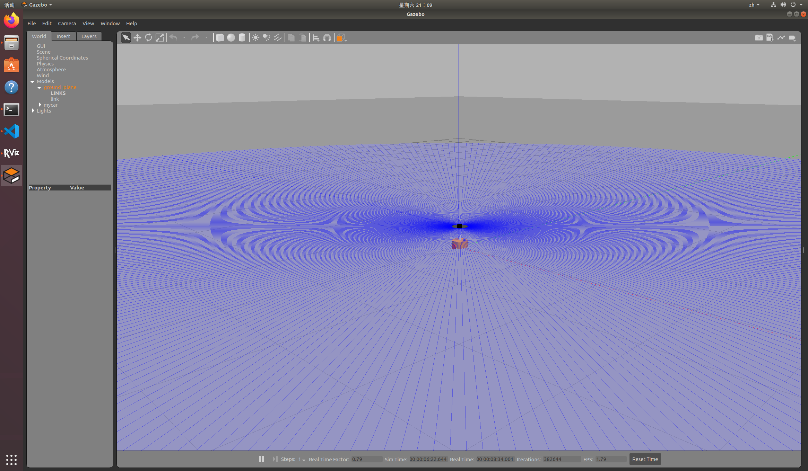
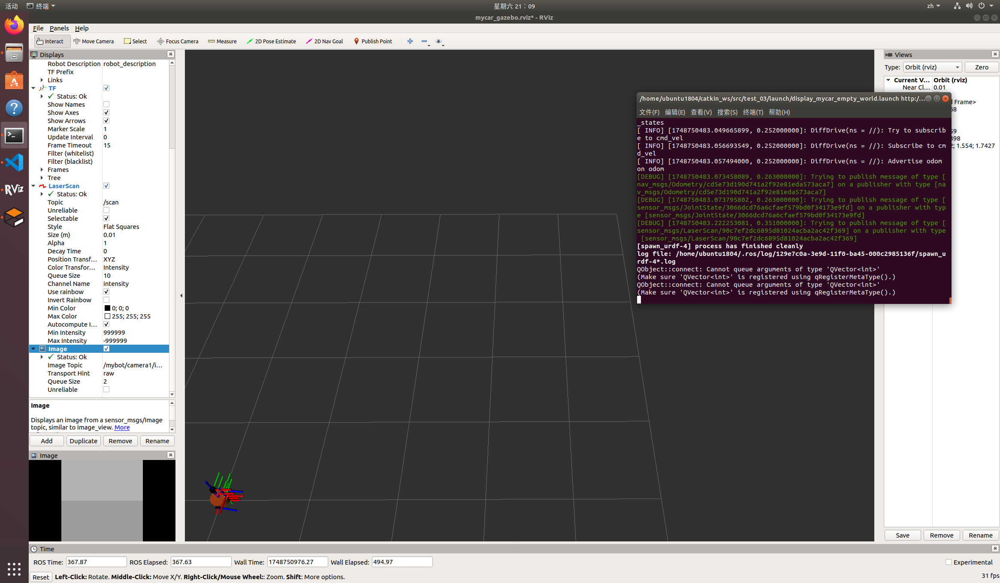

# 基于Gazebo的机器人仿真实验 (test_03)

本项目旨在指导用户在 Ubuntu 18.04 系统下，使用 ROS Melodic 和 Gazebo 9，完成一个自定义机器人模型的创建、Gazebo环境集成、以及复杂的运动控制。实验内容包括 URDF/Xacro 编程、Gazebo 仿真环境搭建与机器人加载、以及通过键盘和多种Python脚本（包括开环、闭环PID及自适应PID尝试）控制机器人运动。

[相关截图&视频](docs/)

## 目录

1.  [实验目的](#实验目的)
2.  [实验环境与依赖](#实验环境与依赖)
3.  [项目结构](#项目结构)
4.  [构建与运行步骤](#构建与运行步骤)
    *   [4.1 克隆与准备工作空间](#41-克隆与准备工作空间)
    *   [4.2 编译功能包](#42-编译功能包)
    *   [4.3 启动仿真环境与机器人模型](#43-启动仿真环境与机器人模型)
    *   [4.4 手动控制机器人](#44-手动控制机器人)
    *   [4.5 自动巡逻 (开环 - `rectangle_patrol.py`)](#45-自动巡逻-开环---rectangle_patrolpy)
    *   [4.6 自动巡逻 (闭环 - `rectangle_patrol_closed_loop.py`)](#46-自动巡逻-闭环---rectangle_patrol_closed_looppy)
    *   [4.7 自动巡逻 (PID航点导航 - `waypoint_navigation_pid.py`)](#47-自动巡逻-pid航点导航---waypoint_navigation_pidpy)
    *   [4.8 自动巡逻 (自适应PID尝试 - `self_adjust.py`)](#48-自动巡逻-自适应pid尝试---self_adjustpy)
    *   [4.9 (可选) 加载自定义世界](#49-可选-加载自定义世界)
5.  [主要文件说明](#主要文件说明)
    *   [Xacro 文件](#xacro-文件)
    *   [Launch 文件](#launch-文件)
    *   [Python 脚本](#python-脚本)
    *   [其他文件](#其他文件)
6.  [预期结果与截图示例](#预期结果与截图示例)
7.  [故障排除与常见问题](#故障排除与常见问题)

---

## 1. 实验目的

*   掌握 URDF/Xacro 文件的编程与组织。
*   掌握 Gazebo 仿真软件的基本使用，包括加载模型、搭建环境。
*   理解机器人模型与 Gazebo 集成的关键配置（collision, inertial, Gazebo-specific tags）。
*   实现通过 ROS 话题 (`/cmd_vel`) 控制仿真机器人运动。
*   体验开环控制、简单闭环控制、PID控制以及初步的自适应PID控制思想。
*   学习调试和优化机器人运动控制参数。

---

## 2. 实验环境与依赖

*   **操作系统**: Ubuntu 18.04 LTS
*   **ROS 版本**: ROS Melodic Morenia (`ros-melodic-desktop-full` 推荐)
*   **Gazebo 版本**: Gazebo 9.x (随 `ros-melodic-desktop-full` 安装)
*   **Python**: Python 2.7 (ROS Melodic默认)
*   **其他依赖**:
    *   `xacro`: 用于处理 Xacro 文件。
    *   `gazebo_ros_pkgs`: Gazebo 与 ROS 的集成包。
    *   `gazebo_plugins`: Gazebo 常用插件。
    *   `robot_state_publisher`: 发布机器人TF变换。
    *   `joint_state_publisher_gui`: (可选) 用于调试关节。
    *   `rviz`: ROS 可视化工具。
    *   `teleop_twist_keyboard`: 键盘遥控节点。
    *   `numpy`: (如果 `self_adjust.py` 或其他脚本中使用) Python数值计算库。

---

## 3. 项目结构

```
catkin_ws/                # Catkin 工作空间根目录
└── src/                  # 源文件目录
    └── test_03/          # 本项目功能包 (TEST_03)
        ├── .gitignore
        ├── CMakeLists.txt
        ├── README.md         # 本文档
        ├── docs/             # 文档和截图文件夹
        │   └── (screenshots/)
        ├── include/test_03/  # (C++头文件目录, 可能为空)
        ├── launch/           # Launch 文件
        │   ├── display_mycar_custom_world.launch
        │   └── display_mycar_empty_world.launch
        ├── models/           # (Gazebo 模型SDF等, 可能为空)
        ├── rviz/             # RViz 配置文件
        │   └── mycar_gazebo.rviz
        ├── scripts/          # Python 控制脚本
        │   ├── rectangle_patrol_closed_loop.py
        │   ├── rectangle_patrol.py
        │   ├── self_adjust.py
        │   ├── test.py
        │   └── waypoint_navigation_pid.py
        ├── src/              # (C++源文件目录, 可能为空)
        ├── urdf/             # (URDF文件目录, 如果Xacro在此则为空)
        ├── worlds/           # (自定义 Gazebo 世界文件, 可能为空)
        ├── xacro/            # Xacro (URDF) 文件
        │   ├── camera.xacro
        │   ├── car_base.xacro
        │   ├── head.xacro
        │   ├── laser.xacro
        │   └── mycar.xacro
        ├── fallback.txt      # (未知用途文件)
        └── package.xml
```

---

## 4. 构建与运行步骤

### 4.1 克隆与准备工作空间

如果您是直接获取本项目文件，请将其放置在您的 Catkin 工作空间的 `src` 目录下。如果您是首次创建 Catkin 工作空间：

```bash
# 1. 创建Catkin工作空间 (如果还没有)
mkdir -p ~/catkin_ws/src
cd ~/catkin_ws/src

# 2. (如果需要) 克隆或复制 test_03 功能包到此 src 目录下
# git clone <repository_url> test_03  或者 cp -r /path/to/TEST_03 ./test_03
# (确保包名是 test_03，而不是 TEST_03，以匹配 rosrun/roslaunch)

# 3. 返回工作空间根目录
cd ~/catkin_ws/
```

### 4.2 编译功能包

在 Catkin 工作空间的根目录下执行 `catkin_make`：

```bash
cd ~/catkin_ws/
catkin_make
```
编译成功后，刷新当前终端的环境变量：
```bash
source devel/setup.bash
```
**注意**: 每次打开新的终端操作本项目时，都需要执行 `source ~/catkin_ws/devel/setup.bash`。

<!-- 截图示例：catkin_make_success.png (放置编译成功的终端截图) -->
<!--  -->

### 4.3 启动仿真环境与机器人模型

此步骤将启动 Gazebo 仿真环境，加载一个空世界，并在其中生成 `mycar` 机器人模型。同时也会启动 RViz 进行可视化。

```bash
roslaunch test_03 display_mycar_empty_world.launch
```

成功启动后，您应该能看到 Gazebo 窗口和 RViz 窗口。
*   **Gazebo**: 显示机器人在一个空旷的地面上。
    <!-- 截图示例：gazebo_spawn.png (放置Gazebo中机器人成功加载的截图) -->
    <!--  -->
*   **RViz**: （如果配置文件 `mycar_gazebo.rviz` 正确配置或手动添加显示项）显示机器人的模型、TF坐标系、以及可能的传感器数据（如激光雷达扫描点、相机图像）。
    <!-- 截图示例：rviz_model.png (放置RViz中机器人模型显示的截图) -->
    <!--  -->

**确保Gazebo中的仿真时间正在运行 (Gazebo左下角时间在增加，或者没有显示 "paused")。**

### 4.4 手动控制机器人

在机器人模型成功加载到 Gazebo 后，打开一个新的终端，并确保已 `source` 工作空间：

```bash
# 新终端
source ~/catkin_ws/devel/setup.bash
rosrun teleop_twist_keyboard teleop_twist_keyboard.py
```
此终端会显示键盘按键与机器人运动的对应关系。激活此终端窗口，根据提示使用键盘（如 `i` 前进, `j` 左转, `l` 右转, `,` 后退, `k` 停止）控制机器人。

<!-- 截图示例：keyboard_teleop.png (放置键盘控制终端和Gazebo中机器人响应的截图) -->
<!--  -->

### 4.5 自动巡逻 (开环 - `rectangle_patrol.py`)

此脚本通过预设时间和速度控制机器人走一个近似的矩形路径（开环控制）。

确保 Gazebo 仿真正在运行。打开一个新的终端：

```bash
# 新终端
source ~/catkin_ws/devel/setup.bash
rosrun test_03 rectangle_patrol.py
```
机器人将开始自动移动。由于是开环控制，路径可能不会非常精确。

### 4.6 自动巡逻 (闭环 - `rectangle_patrol_closed_loop.py`)

此脚本使用机器人的里程计信息 (`/odom`) 进行反馈，尝试更精确地控制机器人走一个矩形路径（简单闭环控制）。

确保 Gazebo 仿真正在运行。打开一个新的终端：

```bash
# 新终端
source ~/catkin_ws/devel/setup.bash
rosrun test_03 rectangle_patrol_closed_loop.py
```

### 4.7 自动巡逻 (PID航点导航 - `waypoint_navigation_pid.py`)

此脚本实现了基于PID控制的航点导航。机器人将按顺序访问在脚本中预定义的一系列目标点。参数（如目标点、PID增益、速度等）可在脚本文件头部进行配置。

确保 Gazebo 仿真正在运行。打开一个新的终端：

```bash
# 新终端
source ~/catkin_ws/devel/setup.bash
rosrun test_03 waypoint_navigation_pid.py
```

### 4.8 自动巡逻 (自适应PID尝试 - `self_adjust.py`)

*(请根据 `self_adjust.py` 的实际功能和参数来描述这部分，并提供运行命令)*

例如：此脚本实现了更高级的PID参数自适应调整功能。它会监测机器人的运动性能（如超调、震荡），并根据预设规则动态修改PID增益，以期在不同条件下获得更平滑和精确的运动效果。目标点和初始PID参数可在脚本文件头部配置。

确保 Gazebo 仿真正在运行。打开一个新的终端：
```bash
# 新终端
source ~/catkin_ws/devel/setup.bash
rosrun test_03 self_adjust.py
```

<!-- 截图示例：rectangle_patrol_path.png (如果可以，展示Gazebo中机器人巡逻路径，或RViz中odom轨迹) -->
<!--  -->

### 4.9 (可选) 加载自定义世界

如果您在 `worlds` 目录下创建了自定义的 `.world` 文件 (例如 `my_custom_world.world`)，可以使用以下命令加载：

```bash
roslaunch test_03 display_mycar_custom_world.launch
```
**注意**: 您需要确保 `display_mycar_custom_world.launch` 文件中的 `world_name` 参数指向您正确的 world 文件。

---

## 5. 主要文件说明

### Xacro 文件 (`test_03/xacro/`)

*   **`head.xacro`**: 定义了计算标准几何体（球体、圆柱、立方体）惯性矩阵的宏。
*   **`car_base.xacro`**: 定义了机器人的主要结构，包括 `base_link` (车体)、驱动轮、支撑轮，以及它们的 `visual`, `collision`, `inertial` 属性和 `joint` 连接。还包含了Gazebo中轮子的物理属性和颜色。
*   **`camera.xacro`**: 定义了摄像头连杆 (`camera_link`)及其视觉、碰撞、惯性属性。集成了 `libgazebo_ros_camera` 插件，使其能在Gazebo中模拟相机并发布图像数据。
*   **`laser.xacro`**: 定义了雷达支撑杆 (`support_link`) 和雷达本身 (`laser_link`)。集成了 `libgazebo_ros_laser` 插件，使其能在Gazebo中模拟激光雷达并发布扫描数据。
*   **`mycar.xacro`**: 顶层Xacro文件，通过 `<xacro:include>` 引入其他组件文件，将它们组合成完整的 `mycar` 机器人模型。关键在于集成了 `libgazebo_ros_diff_drive.so` 差速驱动插件，使机器人能够响应 `/cmd_vel` 话题进行运动，并发布 `/odom` 里程计信息。

### Launch 文件 (`test_03/launch/`)

*   **`display_mycar_empty_world.launch`**:
    1.  加载 `mycar.xacro` 模型到 `robot_description` 参数服务器。
    2.  启动 Gazebo 空世界环境。
    3.  在 Gazebo 中生成 `mycar` 模型。
    4.  启动 `robot_state_publisher`。
    5.  启动 `rviz` 并加载 `mycar_gazebo.rviz` 配置。
*   **`display_mycar_custom_world.launch`**: 与前者类似，但加载自定义的 `.world` 文件。

### Python 脚本 (`test_03/scripts/`)

在运行这些脚本前，请确保它们具有执行权限 (`chmod +x <script_name>.py`)。

*   **`rectangle_patrol.py`**:
    *   简单的开环控制脚本，使机器人沿预设的矩形路径运动。
*   **`rectangle_patrol_closed_loop.py`**:
    *   基于里程计反馈的闭环控制脚本，用于更精确地跟踪矩形路径。
*   **`waypoint_navigation_pid.py`**:
    *   实现了基于PID控制器的航点导航。机器人按顺序访问在脚本头部定义的 `TARGET_WAYPOINTS`。
    *   包含对线速度、角速度的平滑控制、末端精确停靠逻辑以及可配置的PID参数。
*   **`self_adjust.py`**:
    *   *(请根据此脚本的实际功能进行详细描述。例如：一个实验性的自适应PID控制脚本，尝试根据机器人的实时运动性能（如超调、震荡、稳定时间）动态调整PID参数，以适应不同的运动条件和速度设定。)*
*   **`test.py`**:
    *   *(请根据此脚本的实际功能进行详细描述。例如：用于测试特定机器人功能、传感器数据处理、或小段运动控制算法的通用测试脚本。)*

### 其他文件

*   **`.gitignore`**: 指定Git版本控制时应忽略的文件和目录（如编译产物 `build/`, `devel/` 等）。
*   **`CMakeLists.txt`**: Catkin编译系统的构建规则文件。
*   **`package.xml`**: ROS功能包的清单文件，描述了包的依赖、作者、许可证等信息。
*   **`rviz/mycar_gazebo.rviz`**: RViz的配置文件，保存了显示项（如RobotModel, TF, LaserScan, Image, Odometry）和视图设置。
*   **`fallback.txt`**: *(未知用途，如果它是项目的一部分，请在此处说明其功能。如果不是，可以从项目中移除。)*

---

## 6. 预期结果与截图示例

*   **Gazebo 启动**: 机器人模型正确显示在 Gazebo 环境中，没有穿模、抖动等异常现象。所有部件（车体、轮子、摄像头、雷达）均可见。
    <!--  -->
*   **RViz 可视化**: 机器人模型在 RViz 中正确显示。TF 树正确。如果相机和雷达插件工作正常，可以添加 `Image` 和 `LaserScan` 显示项来查看传感器数据。
    <!--  -->
*   **键盘控制**: 机器人能够响应键盘指令进行前进、后退、左转、右转。
*   **自动巡逻**:
    *   `rectangle_patrol.py` (开环): 机器人大致沿矩形运动，但路径可能不闭合，有明显累积误差。
    *   `rectangle_patrol_closed_loop.py` (闭环): 路径更接近理想矩形。
    *   `waypoint_navigation_pid.py` / `self_adjust.py` (PID/自适应PID): 机器人能够按预设航点精确移动和转向，运动平滑。最终停靠位置和姿态与目标点高度吻合。
    <!--  -->
*   **传感器数据 (验证插件)**:
    *   相机: 在 RViz 中添加 `Image` 显示，选择 Xacro 中定义的相机话题 (例如 `/mybot/camera1/image_raw`)，应能看到 Gazebo 中的场景。
    *   雷达: 在 RViz 中添加 `LaserScan` 显示，选择 `/scan` 话题，应能看到雷达扫描点。

---

## 7. 故障排除与常见问题

*   **`RLException: Invalid roslaunch XML syntax...`**: 检查对应的 `.launch` 文件是否为空或存在语法错误。
*   **`UnicodeEncodeError: 'ascii' codec can't encode characters...`**:
    *   **Xacro/URDF**: 检查 `.xacro` 文件中是否有非 ASCII 字符（如中文注释）。
    *   **Python 脚本**: 在 Python 脚本文件开头添加 `# -*- coding: utf-8 -*-`。
*   **`SyntaxError: invalid syntax` (Python f-string等)**: ROS Melodic 使用 Python 2.7。确保Python代码兼容Python 2.7语法。
*   **Gazebo GUI 崩溃 (`VMware: vmw_ioctl_command error...`)**:
    *   尝试在 launch 文件中添加 `<env name="LIBGL_ALWAYS_SOFTWARE" value="true"/>`。
    *   更新 VMware Tools / 调整3D加速设置。
*   **`[rosrun] Couldn't find executable named ... or not executable`**:
    *   Python 脚本没有执行权限: `chmod +x path/to/script.py`。
    *   未 `source devel/setup.bash`。
*   **机器人模型在 Gazebo 中抖动/滑动**:
    *   检查 `<inertial>` 标签是否正确且合理。
    *   检查 `<collision>` 几何体。
    *   检查轮子的 Gazebo 物理属性。
*   **机器人不响应 `/cmd_vel`**:
    *   确认差速驱动插件 (`libgazebo_ros_diff_drive.so`) 已在 `mycar.xacro` 中正确配置。
    *   检查 `commandTopic` 等参数。
*   **直线运动震荡/弯曲**:
    *   主要调整移动时的角度PID参数 (`PID_ANGULAR_MOVE_KP`, `KD`, `KI`)。通常需要降低KP，增加KD，并将KI暂时设为0。
    *   检查并减小最小驱动角速度 (`min_move_angular_speed`)。
    *   适当降低最大线速度。
*   **冲过目标点**:
    *   降低最大线速度。
    *   让减速更早开始 (`DECELERATION_START_TIME_FACTOR` 增大)。
    *   使S型减速曲线在末端更陡峭 (`K_DIST_DECELERATION` 增大)。
    *   减小末端接近速度上限 (`FINAL_APPROACH_LINEAR_SPEED_CAP`)。
    *   调整PID参数以适应更精细的末端控制。

---